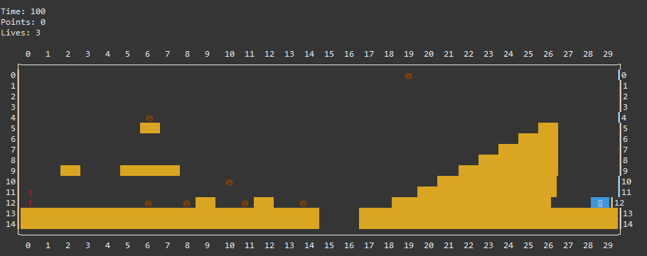

# 🍄 Super Mario Bros Clone - Console Edition (Java)

[](https://youtu.be/ZcKEf89TuFc)


A fully playable Super Mario Bros clone running entirely in the command-line terminal. This project was initially developed as a coursework practice at Universidad Complutense de Madrid (UCM), with a strong focus on **Object-Oriented Programming (OOP)** and **Clean Code**.

## 🚀 Features & Upgrades
Building upon the base university project, I expanded the game engine by implementing advanced features to push the software design further:
- **2-Player Mode (`action2player`):** Mario and Luigi playable simultaneously on the same board.
- **Weapons & Environment:** Implemented Grenades with bouncing physics, Star boxes for temporary immunity, and a "The Floor is Lava" mode.
- **Space Alteration Commands:** Entity teleportation (`teleport`) and a mirror mode (`verticalMirrorPositions`).
- **Save System:** Game state can be saved and loaded using `.txt` files.

## 🧠 OOP Design & Concepts
The core of this project is to demonstrate a solid understanding of Object-Oriented Programming pillars in Java:
- **Inheritance & Abstract Classes:** Unified Mario and Luigi's movement and physics logic through an abstract `Player` class, which inherits from `MovingObject` and `GameObject`, applying the **DRY (Don't Repeat Yourself)** principle.
- **Polymorphism:** All interactive elements respond to the abstract `update()` and `interactWith()` methods in radically different ways (e.g., a Goomba walks, a Star Box does nothing until touched) without the main game loop needing to know which specific object is being updated.
- **Custom Exception Handling:** Created a custom exception hierarchy (`GameModelException`, `CommandParseException`, `OffBoardException`) to separate error logic from business logic, ensuring the program is robust against invalid user inputs.
- **Encapsulation & Factory Pattern:** Concealed internal object states and centralized entity instantiation from files via the `GameObjectFactory` class.

## 👥 Authors & Development Phases
This repository reflects two distinct development phases:
1. **Expansion & Refactoring (Current `main` Version):** Developed **100% individually** by **[Saneli Ghamari]**. After finishing the course, I voluntarily improved the codebase to the next level by adding complex physics, a 2-player mode, and refactoring the entity system using advanced inheritance.
2. **Base Project (See `legacy-base` branch):** The core game engine and initial class structure were developed as a pair programming project alongside **[María Duque]**.

## 🎮 How to Play
1. Compile the code ensuring you are using Java 17 or higher.
2. Execute the entry point `tp1.Main`. You can pass the difficulty level and view mode as arguments:
   ```bash
   java tp1.Main 1 colors
3. Use the help command in-game to see all available moves and actions.
